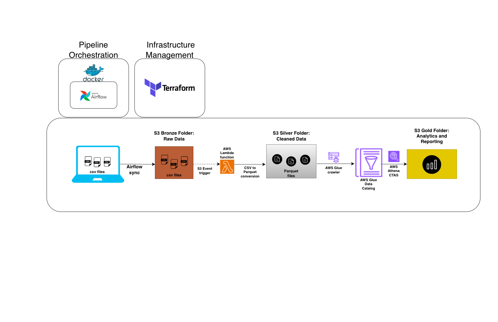
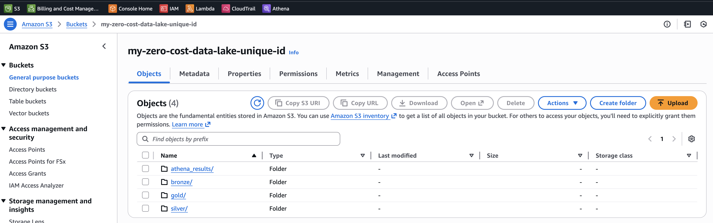
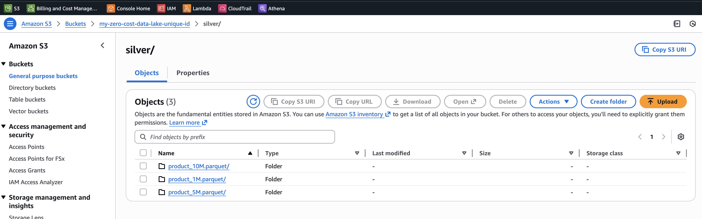
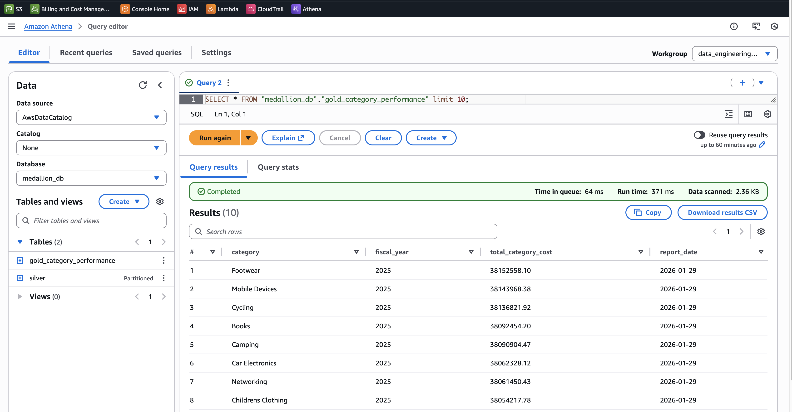
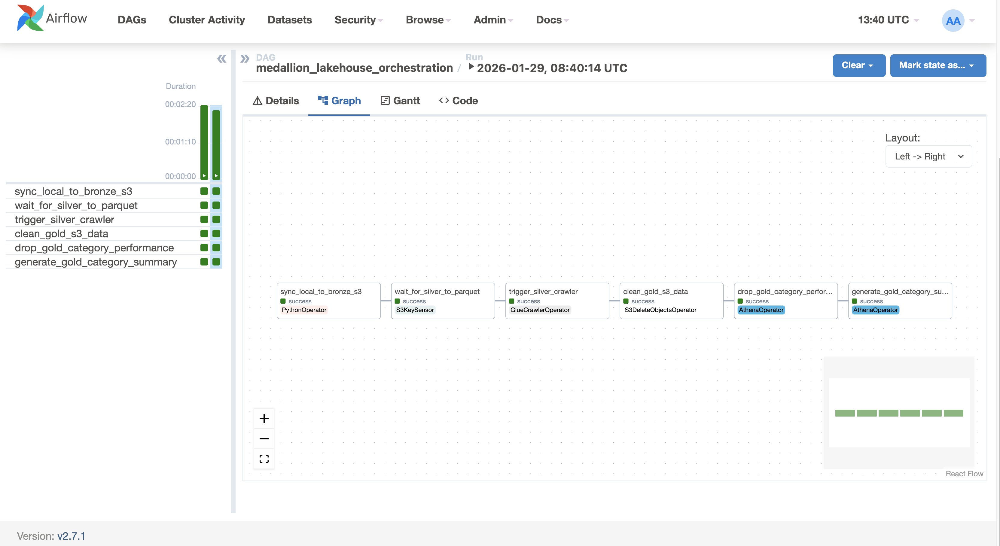
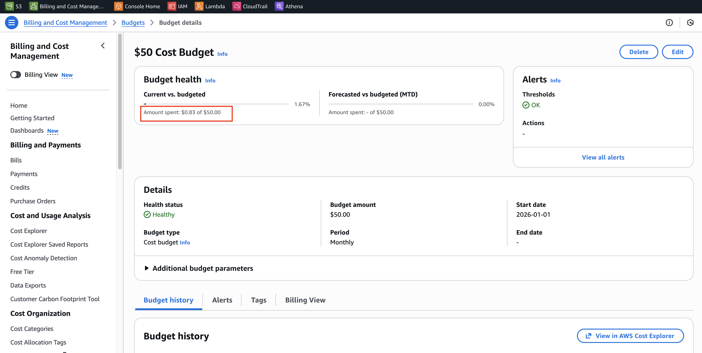
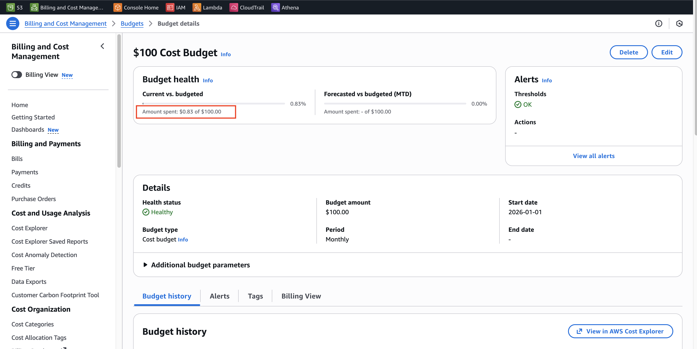

# Serverless Medallion Data Lakehouse
## An automated, event-driven ETL pipeline built to process large-scale CSV data (15M+ rows) into a structured Data Lakehouse using the Medallion Architecture.

## Project at a Glance

| Category | Details |
| :--- | :--- |
| **Primary Goal** | Build a scalable Medallion Lakehouse (Bronze-> Silver ->Gold) for 15M+ records. |
| **Tech Stack** | Python (Pandas), AWS (S3, Lambda, Glue, Athena), Terraform, Airflow, Docker. |
| **Data Volume** | Successfully processed and transformed **16,000,000 rows** of synthetic data. |
| **Infrastructure** | Fully automated via **Terraform** (Infrastructure as Code). |
| **Security** | Scoped **IAM Least Privilege** and Resource-level S3 policies. |
| **FinOps** | **$0.83** total cost (offset by credits) with multi-tier **AWS Budget** alerts. |

## 1. Architecture Overview

The pipeline follows the **Medallion Architecture** to ensure data quality and lineage:

* **Bronze (Raw):** Landing zone for raw CSV files. Airflow syncs local data to S3 using an idempotent, incremental check.
* **Silver (Cleaned):** Triggered by S3 events, an [**AWS Lambda**](lambda_function.py) function processes CSVs into **Parquet** using `awswrangler`. It handles memory constraints via **chunking** to process 10M+ rows efficiently.
* **Gold (Curated):** Business-ready aggregated views created via **Amazon Athena** (CTAS) and managed by [**Airflow**](airflow/dags/medallion_flow.py).

*Screenshot of the S3 bucket hierarchy (Gold, Silver, Bronze) provisioned via [Terraform](terraform/main.tf).*

*Screenshot of the successful csv to parquet conversion in the silver S3 folder*

*Screenshot of the preview query and resultant generated gold layer table*

## 2. Key Features
* **Infrastructure as Code (IaC):** 100% automated infrastructure using **Terraform**.
* **Memory-Efficient Processing:** Lambda uses `pandas` chunking to process files larger than its assigned RAM.
* **Idempotent Ingestion:** Airflow logic checks for existing files in S3 before uploading, preventing duplicate costs and processing.
* **Orchestration:** Airflow manages the end-to-end lifecycle, including Glue Crawler triggers the Athena gold-layer transformation.

*The below screenshot shows the Airflow DAG*

## 3. Tech Stack
* **Orchestration:** Apache Airflow (Dockerized)
* **Cloud:** AWS (S3, Lambda, Glue, Athena, IAM)
* **IaC:** Terraform
* **Languages:** Python (Pandas, Boto3, AWS Wrangler), SQL
* **Data Format:** CSV (Raw) to Parquet (Optimized)

## 4. Security and IAM(Permissions)
I used Terraform to build the security for this project. Instead of just giving everything full access, I followed the Principle of Least Privilege. This means I wrote specific rules so each service only has the exact permissions it needs to work.

**How I secured the pipeline:**
* **Restricted S3 Access:** I made sure the Lambda and Glue roles can only "see" my specific project bucket. By using the bucket's unique ID (ARN) in my code, I ensured they can't touch any other data in my AWS account.

* **Smart Permissions (PassRole):** I set up a special rule that only allows Airflow to hand off tasks to the Glue service. This prevents a common security risk where one service might be used to run unauthorized commands.

* **Automatic Identity Checks:** I used Terraform to automatically detect my account details. This makes the setup more secure because it ensures only my specific user can trigger the pipeline roles.

* **Data Isolation:** The "Gold" layer of the project is protected. I limited the Airflow and Athena permissions so they can only interact with the medallion_db database and nothing else.

## 5. Cost Analysis and Monitoring (FinOps)
I treated cost management as a core feature of this project. Even though I was working with 10M+ rows of data, I kept the entire pipeline highly cost-efficient by using serverless tools.

**Total Project Cost:** The total infrastructure cost for processing 10M+ rows was $0.83, which was fully covered by AWS Credits.

* **Tiered Financial Guardrails:** I implemented a two-stage alert system to stay ahead of any potential costs:

    * Stage 1 ($50.00): An early-warning budget threshold designed to notify me well before I exhausted my available credits.

    * Stage 2 ($100.00): A secondary guardrail with an automated alert set at 80% of this limit to prevent any significant out-of-pocket expenses.

* **Automated Notifications:** These budgets are linked to Amazon SNS, which automatically emails me the moment a threshold is crossed. This allows me to experiment with large datasets while knowing exactly how much I'm spending in real-time.

* **Proactive Monitoring:** I tracked my spending regularly in the Billing Console to understand how any actions taken throughout development impacted my bill.

*Screenshot of my AWS Budget dashboard, showing the $0.83 spend against my tiered safety-net budgets.*

## 6. Engineering Decisions and Learnings
I wanted to focus on building a pipeline that isn't just functional but also efficient and cost-conscious.

* **Handling Big Data on a Budget:** I used **Pandas chunking** (100,000 rows at a time) in my Lambda function. This was a key learning for me. It allowed me to process the 10M row dataset without needing a massive, expensive server or crashing the Lambda's memory.
* **Saving Costs with Parquet:** I chose to convert the raw CSVs into **Parquet** files in the Silver layer. I learned that because Parquet is columnar, it makes **Amazon Athena** queries much faster and cheaper since it doesn't have to read the whole file.
* **Smart Uploads:** I wrote the Airflow ingestion logic to check if a file already exists in S3 before uploading. This makes the pipeline **idempotent**, meaning I can run the DAG multiple times without creating duplicate data or wasting bandwidth.
* **Automation with Terraform:** I decided to define all my AWS resources (S3, Lambda, IAM) in **Terraform**. This helped me understand how different cloud services connect and ensures I can tear down or rebuild the entire stack with just one command.
* **FinOps & Cloud Monitoring:** A major learning was managing Cloud Financial Operations. By investigating a minor $0.83 charge, I learned how to read AWS Billing Invoices, use AWS Credits effectively, and implement multi-tiered Budget Alerts to ensure the project stayed within the Free Tier.

